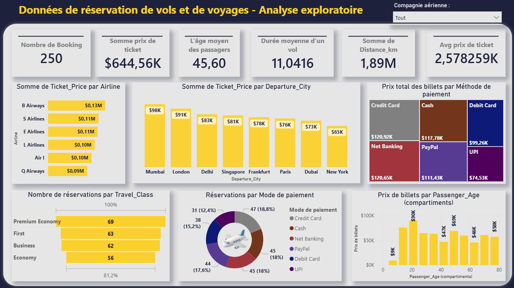

# Flight Booking & Travel Analysis Dashboard - Power BI

##  Project Overview

This project is a Business Intelligence and Data Analysis solution developed using Power BI.

The objective of this project is to analyze flight booking and travel reservation data in order to extract useful insights about:

- Passenger behavior
- Ticket prices
- Flight duration
- Airlines performance
- Payment methods
- Travel classes

The dashboards help transform raw data into interactive visual analytics for decision-making.

---

# Dashboards Included

## Screenshots

| Vue 1 | Vue 2 |
|------|------|
|  |  |

## 1️Exploratory Analysis Dashboard

This dashboard focuses on:

- Total bookings
- Total ticket revenue
- Average passenger age
- Average ticket price
- Airline analysis
- Departure city analysis
- Payment methods
- Travel classes
- Passenger age vs ticket price

### Key Insights
- Premium Economy is the most booked class
- Mumbai generates the highest ticket revenue
- Credit Card is the most used payment method

---

## Flight Duration Analysis Dashboard

This dashboard focuses on:

- Average flight duration
- Variance and standard deviation
- Flight duration by airline
- Flight duration by passenger age
- Flight duration by travel class
- Price vs duration relationship

### Key Insights
- Air I has the longest average flights
- Business class has the highest flight duration
- Ticket price is not strongly correlated with flight duration

---

# Tools & Technologies

- Power BI
- Power Query
- Data Visualization
- ETL (Data Cleaning & Transformation)

---

# ETL Process

In this project, ETL operations were performed using Power Query inside Power BI.

The transformations included:

- Data cleaning
- Data type conversion
- Handling missing values
- Data formatting

---

# Features

- Interactive dashboards
- Dynamic filtering
- KPI cards
- Charts and visual analytics
- Statistical analysis

---

